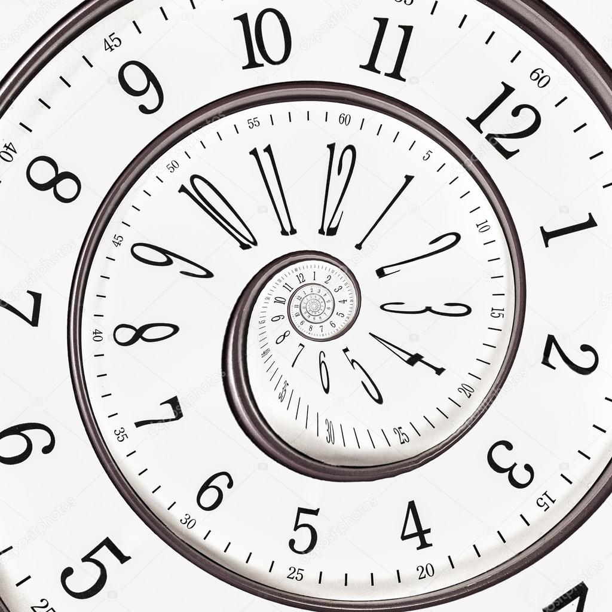
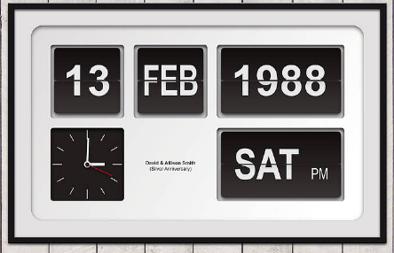
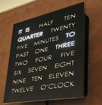
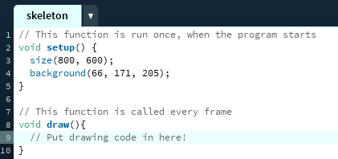
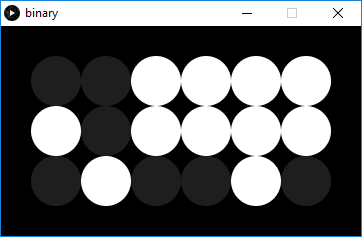
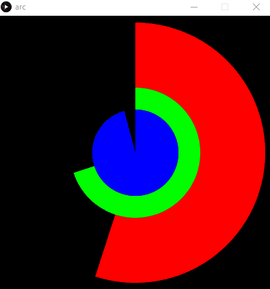

<table style="width:100%">
  <tr>
    <td></td>
    <td></td>
    <td></td>
  </tr>
</table>

# Workshop Objective: Reinvent the Clock

 **The overall objective of this workshop is simple:**

_Have fun while learning some basic programming concepts, and create your own version form of measuring or displaying time._

Don't get too worried about not completely understanding a particular concept or being unable to achieve a specific exercise, as neither of those are the aims of the exercise.

**However, do feel free to let your creativity run wild...**

feel free to go 'off piste' and go beyond the challenges we've laid out here.<br>
Who knows, you might just reinvent the concept of time! 😜

<br>

<br>

## What is Processing?

**In this activity you will be using [Processing](https://processing.org), a Java based flexible software sketchbook.**


> If you are doing this workshop in a lab on a University Visit Day, then Processing will already be installed and will be set up on half of your screen.<br>
> If not, [Click Here](https://processing.org/tutorials/gettingstarted/) for more info on getting started.

Processing is easy for creating visual art with a few simple lines, and is ideal for learning how to code.<br>
There are both Javascript and Java variants, but today we'll be using the Java.

The Processing programming environment might seem familiar to those of you who have used an Integrated Development Environment _(IDE)_ before, however experience with IDE's is not a prerequisite for this workshop, so do not worry if some of this looks unfamiliar at first!

Students, artists, designers, researchers, and hobbyists use Processing for learning and prototyping projects.<br>
[Visit this link](https://processing.org/exhibition/) to see some of the examples of interesting prototypes and projects.

--------------------------------------------------------------------------------

## Timings

This workshop was created for Applicant Visit Days at the University of Bristol, and the rough timings for each section are below:

- 14:15 Intro
- 14:20 Intro to Processing - Drawing Program
- 14:35 Clock Program Challenges - Playing with Time
- 14:50 Group Work - Design a New Clock
- 15:10 Presentations

**If you have any questions at any point, please ask a teaching assistant for help!**

<br>

--------------------------------------------------------------------------------

<br>
<br>
<br>

# Pen Up, Pen Down

**First off we are going to introduce you to Processing by creating a simple drawing program.**


--------------------------------------------------------------------------------

## Step 1

**Setting up your sketch's window.**

The **setup()** function is run once, when the program starts, and sets up the window and the main processing program

```java
void setup() {

}
```

The **size(width, height)** function defines the dimensions of the screen:<br>
`size(800, 600);`

The **background(red, green, blue)** function defines the background colour of the screen:<br>
`background(66, 171, 205);`<br>
To learn more about how colours work in Processing, [see here](https://processing.org/tutorials/color/).

**Here is a screenshot to show how it fits together:**<br>
Type it out and then run the program with the play button to check it works.<br>


_If you are an experienced programmer, you can try declaring and defining variables/consts instead of hard-coding numbers._

--------------------------------------------------------------------------------

## Step 2

**The draw loop**<br>
If you have successfully created a screen in your `setup()` function, now define a second function `draw()` as shown in the screenshot above.<br>
_This function is repeatedly called whilst your sketch is running, by default 60 times a second._

**The next objective is to try and create a shape on the screen with your mouse.**

The **fill(red, green, blue)** function declares the colour of shapes to be drawn after it:<br>
`fill(205,66,171);`

The **ellipse(x, y, width, height)** function draws an ellipse with its centre at the given location, with given width and height:<br>
`ellipse(250, 200, 100, 250);`

There are loads of other shapes available too, take a look [here](https://processing.org/examples/shapeprimitives.html).

--------------------------------------------------------------------------------

## Step 3

**Mouse Click**<br>
Your program should now draw an ellipse on the screen.<br>
Next we will change it so that an ellipse is only drawn if you click your mouse.

`if` statements allow you to write some code which is only executed if some test condition is true:

```java
if (test) {
    //optional statements
}
```

<br>

The `mousePressed` variable is `true` when any mouse button is pressed, and `false` otherwise, so let's use that in our `if` statement:

```java
if (mousePressed) {
    // code to draw an ellipse
}
```

--------------------------------------------------------------------------------

## Step 4

**Moving the pen**

Your program should now effectively be a pen up and pen down program.<br>
However, a pen that doesn't move is useless.

To make it more realistic use the `mouseX` and `mouseY` variables to draw your ellipse based on where you put your mouse on the screen, and maybe change the size of the pentip too.

--------------------------------------------------------------------------------

### Congratulations!

You should now have a simple painting program in Processing.

Here are a few extensions you could try:

- Try using a different conditional statement. i.e. replace the if statement with either a for-loop, a while-loop or a do-while-loop
- Change the colour with of the ellipse with every mouse click!
- Change the size of the ellipse with every mouse click.

<br>
<br>
<br>

--------------------------------------------------------------------------------

<br>
<br>
<br>

# Playing with Time

**In this exercise you will be creatively modifying the code for a program that draws a working clock.**

First create a new Processing sketch (File -> New)<br>
Then copy and paste in [this code](https://raw.githubusercontent.com/LukeStorry/code-a-clock/master/examples/analogue/analogue.pde) for a simple analogue clock:

```java
int clockCentreX, clockCentreY;
float secondsRadius;
float minutesRadius;
float hoursRadius;
float clockDiameter;

void setup() {
        size(400, 400);
        clockCentreX = width / 2;
        clockCentreY = height / 2;
        int maxRadius = min(width, height) / 2;
        secondsRadius = maxRadius * 0.72;
        minutesRadius = maxRadius * 0.60;
        hoursRadius = maxRadius * 0.50;
        clockDiameter = maxRadius * 1.8;
}

void draw() {
        // reset the sketch
        background(0, 0, 0);

        // calculate angles
        float second_angle = map(second(), 0, 60, 0, TWO_PI) - HALF_PI;
        float minute_angle = map(minute()+5 + norm(second(), 0, 60), 0, 60, 0, TWO_PI) - HALF_PI;
        float hour_angle = map(hour() + norm(minute(), 0, 60), 0, 24, 0, TWO_PI * 2) - HALF_PI;

        // draw clock face
        noStroke();
        fill(80);
        ellipse(clockCentreX, clockCentreY, clockDiameter, clockDiameter);

        stroke(255, 255, 255);
        // draw second hand
        strokeWeight(1);
        line(clockCentreX, clockCentreY, clockCentreX + cos(second_angle) * secondsRadius, clockCentreY + sin(second_angle) * secondsRadius);
        // draw minute hand
        strokeWeight(2);
        line(clockCentreX, clockCentreY, clockCentreX + cos(minute_angle) * minutesRadius, clockCentreY + sin(minute_angle) * minutesRadius);
        //draw  hour hand
        strokeWeight(4);
        line(clockCentreX, clockCentreY, clockCentreX + cos(hour_angle) * hoursRadius, clockCentreY + sin(hour_angle) * hoursRadius);

        // draw markings
        strokeWeight(2);
        beginShape(POINTS);
        for (int degrees = 0; degrees < 360; degrees+=6) {
                float rads = radians(degrees);
                float tick_mark_x = clockCentreX + cos(rads) * secondsRadius;
                float tick_mark_y = clockCentreY + sin(rads) * secondsRadius;
                vertex(tick_mark_x, tick_mark_y);
        }
        endShape();
}
}
```

[Sourcecode on Github](examples/analogue/analogue.pde)

Now press the play button and it you should have a clock that looks like this:<br>


--------------------------------------------------------------------------------

**Great - now try figuring out how it all works, then hacking the clock by trying some of the challenges below.**

Once you've tried this version, maybe try some of the challenges on some of the other example clocks at the bottom.

> If you need any help, just raise your hand and a teaching assistant will come over! :)

--------------------------------------------------------------------------------

## Challenges

### Challenge 1

**Can you make the appearance of this clock nicer?**<br>
For example, try changing its background color, the color and length of its hands, and the number of points of the color.<br>
_For more information on how colours work in Processing, check out this [Link about Colour in Processing](https://processing.org/tutorials/color/)_

### Challenge 2

**Can you make a clock with only hour and minute hands?**<br>
Where is the line of code that draws the second hand?<br>
_Rather than deleting it, you can comment it out using two forward slashes: `//comment`_

### Challenge 3

**Can you give a snapshot of some fixed time such as 18:45pm?**<br>
_Find the **minute_angle** and **hour_angle** variables and manually edit them to show a certain time on the clock._

### Challenge 4

**Can you give another time-zone clock e.g. Beijing time, New York time?**<br>
How about also swapping between time zones with a click of the mouse?<br>
_Find the change in **minute_angle** and **hour_angle** that correspond to the time-zone difference._

<br>
<br>
<br>

--------------------------------------------------------------------------------

<br>
<br>
<br>

# Design Your Own Clock

#### Team up! Group with your neighbours into teams of four people.

**Over the next fifteen minutes you are going to use everything you've learnt so far to create a clock of your own. At the end each group will have a minute to present their new clock idea!**

> _Time to get creative!_

Here's some ideas as starting points!

- Play with colour - can you tell the time just by colour? - [HexClock](http://www.jacopocolo.com/hexclock/)
- Think about shape.
- Is your new clock simple to read or fiendishly complex?
- Think about scale. Is your clock good for looking at seconds or does it work over years?
- Can you make a stopwatch?
- Smooth seconds using millis() and adjusting map()

<br>

--------------------------------------------------------------------------------

<br>

## Presentations

_Time to show off your new creations!_<br>
Prepare a quick presentation that answers some questions people might have about your clock:

- Can the other groups read the time on your new clock?
- Would they want a version on their wall at home?
- Did you use any interesting hacks in your code that you can explain to the other groups?

<br>
<br>
<br>
<br>

--------------------------------------------------------------------------------

<br>
<br>
<br>
<br>

# Example Clocks

Here are some examples of clocks, with their sourcecode, for both inspiration and as a starting point

### Simple Text Clock

This very basic code is a good starting point for creating your own text-based clock.


[Sourcecode](examples/text/text.pde)

--------------------------------------------------------------------------------

### Linear Clock

This clock lays the hours, minutes and seconds out in a table and highlights the current time.

How about playing around by removing all the lines, or creating a different shade for each block?


[Sourcecode](examples/linear/linear.pde)

--------------------------------------------------------------------------------

### Binary Clock

This clock lays the hours, minutes and seconds out in binary. The first row is binary number for the hour, second row for minute, third row for second shown as picture below.



The picture above reads: 001111 hours, 001010 mins, 100111 seconds = 15:47:18 Can you tell why?

[Sourcecode](examples/binary/binary.pde)

--------------------------------------------------------------------------------

### Many Clocks

A previous team of workshop attendees converted the given clock code into a class, to allow 100 random clock to be spawned:


[Sourcecode](examples/manyclocks.pde)

--------------------------------------------------------------------------------

### Arc Clock

By stacking multiple circles and arcs, this clock shows time as a circular loading bar:



[Sourcecode](examples/arc.pde)

--------------------------------------------------------------------------------

### Accelerating Clock

This clock gradually accelerates when clicked:


[Sourcecode](examples/accelerating.pde)

### Blinking Clock

Team "The Illuminati" created this slightly unnerving clock that blinks every second


[Sourcecode](examples/blink.pde)

--------------------------------------------------------------------------------

<br>

### Your Clock!

If your clock is quirky/cool enough, it could be added to this gallery for future workshops.

[Submit your code here!](https://goo.gl/forms/sGz90psADcLvI8ge2)

<br>

--------------------------------------------------------------------------------
=

<br>

### Thanks!

**We hope you enjoyed the workshop!**<br>
If you have any feedback, either tell the person leading workshop, or fill out an issue on the [Github Repo](https://github.com/LukeStorry/code-a-clock/issues).

:)

<br>
<br>
<br>
