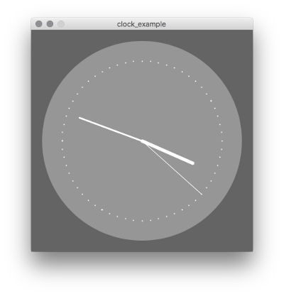
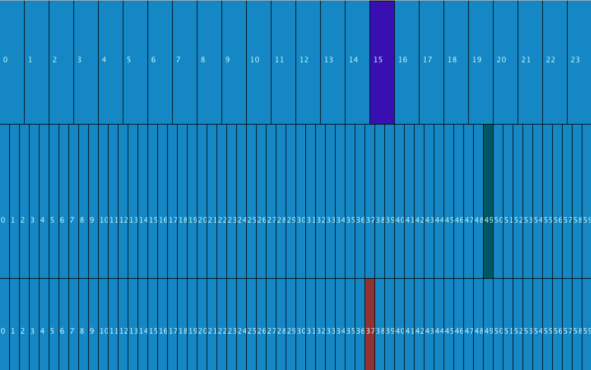
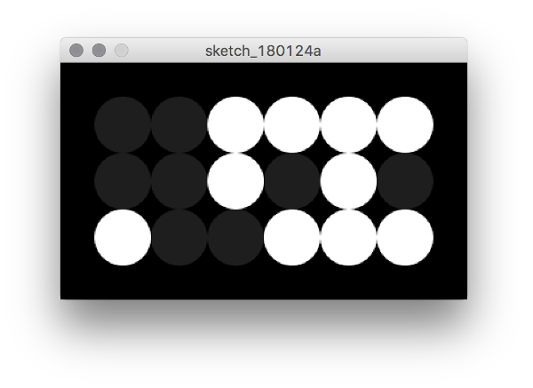
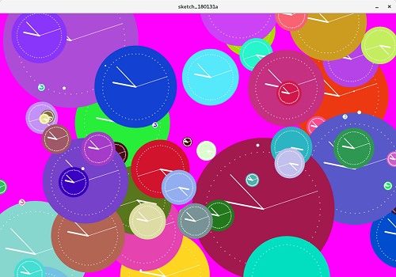
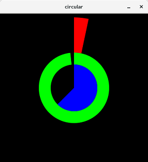

<table style="width:100%">
  <tr>
    <td></td>
    <td></td> 
    <td></td>
  </tr>
</table>


# Workshop Objective: Reinvent the Clock

#### The overall objective of this workshop is simple: Have fun, while learning some basic programming concepts to create your own version of a clock or some other form of measuring time.


>Don't get too worried about not completely understanding a particular concept or being unable to achieve a specific exercise, as neither of those are the aims of the exercise.

However, do feel free to let your creativity run wild... feel free to go 'off piste' and go beyond the challenges we've laid out here. Who knows, you might just reinvent the concept of time! 😜


<br><br>
---
<br><br>


## What is Processing?
#### In this activity you will be using [Processing](https://processing.org), a Java based flexible software sketchbook.

<center>  </center>

> If you are doing this workshop in a lab on a University Visit Day, then Processing will already be installed and set up on half of your screen. If not, [Click Here](https://processing.org/tutorials/gettingstarted/) for more info on getting started. 


Processing is easy for creating visual art with a few simple lines, and is ideal for learning how to code.
There are both Javascript and Java variants, but today we'll be using the Java.

The Processing programming environment might seem familiar to those of you who have used an Integrated Development Environment _(IDE)_ before, however experience with IDE’s is not a prerequisite for this workshop, so do not worry if some of this looks unfamiliar at first!

Students, artists, designers, researchers, and hobbyists use Processing for learning and prototyping projects.
[Visit this link](https://processing.org/exhibition/) to see some of the examples of interesting prototypes and projects.


<br>
---
<br>


## Timings
This workshop was created for Applicant Visit Days at the University of Bristol, and the rough timings for each secion are below:
- 14:15 Intro
- 14:20 Intro to Processing - Drawing Program
- 14:35 Clock Program Challenges - Playing with Time
- 14:50 Group Work - Design a New Clock
- 15:10 Presentations


<br><br><br><br>
---
<br><br><br><br>


# Pen Up, Pen Down 

#### First off we are going to introduce you to Processing by creating a simple drawing program.

>_**If you have any questions at any point, please ask a teaching assistant for help!**_


---
## Step 1:
Write a basic program, using `size()` to define the dimensions of the screen and `background()` to define the colour, within the `setup()` function.

Here is a screenshot to sho how it should be laid out, type it yourself then run the program with the play button to check it works.


>**Explaination:**
>
>The `void setup( ){     }` function is run once, when the program starts, and sets up the window and the main processing program

> The `size(,)` function defines the dimensions of the screen:\
>`size(height, width);`\
>`size(500, 500);`.

>The `background(,,)` function controls the colour of the screen:\
>`background(red, green, blue);`\
>`background(100, 120, 90);


_If you are an experienced programmer, you can try declaring and define variables/consts instead of hard-coding numbers._

---
## Step 2:
If you have successfully created a screen in your `setup()` function, now define a second function `draw()`, as shown in the screenshot above.\
_This function is repeatedly called whilst your sketch is running, by default looping 60 times a second_

**The objective is to try and create a shape on the screen with your mouse.**

>The `fill` function can be used to control the colour of shapes:\
>`fill(red, green, blue)`\
>`fill(200, 200, 200);`

>The `ellipse()` function draws an ellipse at a given location, with given width and height:\
>`ellipse(centre_x, centre_y, width, height);`\
>`ellipse(250, 250, 100, 50);`


---
## Step 3:
Your program should now draw an ellipse on a blank screen.\
Try refactoring/changing it so that an ellipse is only drawn if you click your mouse.

>__To do this you’ll need to use an `if` statement:__\
>“if mouse is clicked draw an ellipse, else do nothing”.

>`if` statements allow you to write some code which is only executed if some test condition is true:
>
>```java
if (test) {
  // optional statements
}
```


The `mousePressed` variable is `true` when any mouse button is pressed.\
It is `false` otherwise.


```java
if (mousePressed) {
 // code to draw an ellipse
}
```

## Step 4:
Your program should now effectively be a pen up and pen down program.\
However, a pen that doesn''t move is useless.

To make it more realistic use the `mouseX` and `mouseY` variables to draw your ellipse based on where you put your mouse on the screen.

<br>

### Congratulations.
You should now have a simple painting program in Processing.

Here are a few extensions you could try:
- Try using a different conditional statement. I.e. replace the if statement with either a for-loop, a while-loop or a do-while-loop
- Change the colour with of the ellipse with every mouse click !
- Change the size of the ellipse with every mouse click.


<br><br><br><br>

---

<br><br><br><br>

# Playing with Time
#### In this exercise you will be creatively modifying the code for a program that draws a working clock.

First create a new Processing sketch (File -> New)

Then copy and paste in this example code:
```java
int clockCentreX, clockCentreY;
float secondsRadius;
float minutesRadius;
float hoursRadius;
float clockDiameter;

void setup() {

size(400, 400);
clockCentreX = width / 2;
clockCentreY = height / 2;
int maxRadius = min(width, height) / 2;
secondsRadius = maxRadius * 0.72;
minutesRadius = maxRadius * 0.60;
hoursRadius = maxRadius * 0.50;
clockDiameter = maxRadius * 1.8;
}

void draw() {
  int all_black = 0;
  int all_grey = 80;
  int all_white = 255;
  background(all_black, all_black, all_black);
  fill(all_grey, all_grey, all_grey);
  noStroke();
  ellipse(clockCentreX, clockCentreY, clockDiameter, clockDiameter);

  float second_angle = map(second(), 0, 60, 0, TWO_PI) - HALF_PI;
  float minute_angle = map(minute() + norm(second(), 0, 60), 0, 60, 0, TWO_PI) - HALF_PI;
  float hour_angle = map(hour() + norm(minute(), 0, 60), 0, 24, 0, TWO_PI * 2) - HALF_PI;

  stroke(all_white, all_white, all_white);
  // control the thickness of the hand
  strokeWeight(1);
  line(clockCentreX, clockCentreY, clockCentreX + cos(second_angle) * secondsRadius, clockCentreY + sin(second_angle) * secondsRadius);
  // minute hand
  strokeWeight(2);
  line(clockCentreX, clockCentreY, clockCentreX + cos(minute_angle) * minutesRadius, clockCentreY + sin(minute_angle) * minutesRadius);
  // hour hand
  strokeWeight(4);
  line(clockCentreX, clockCentreY, clockCentreX + cos(hour_angle) * hoursRadius, clockCentreY + sin(hour_angle) * hoursRadius);


  strokeWeight(2);
  beginShape(POINTS);
  for (int degrees = 0; degrees < 360; degrees+=6) {
  float rads = radians(degrees);
  float tick_mark_x = clockCentreX + cos(rads) * secondsRadius;
  float tick_mark_y = clockCentreY + sin(rads) * secondsRadius;
  vertex(tick_mark_x, tick_mark_y);
  }
  endShape();
}
```
[Sourcecode on Github](https://github.com/LukeStorry/code-a-clock/blob/master/example_code/simple_clock.pde)


Now press the play button and it you should have a clock that looks like this:



---


Great - now try figuring out how it all works, then hacking the clock by trying some of the challenges below.

Feel free to pick and choose, no need to do them in order.

Also, it's no problem to go beyond the challenges and try just generally playing around with the code.

Once you've tried this version, maybe try some of the challenges on some of the other example clocks at the bottom.

>If you need any help, please ask a teaching assistant!


## Challenges

#### Challenge 1:
Can you make the appearance of this clock nicer by changing its background color, the color and length of its hands, and the number of points of the color, for example?

>Colours are given in (Red, Green and Blue) values, 0 means none of that colour and 255 means full.
To make purple you mix red and blue, so try (255, 0, 255).


#### Challenge 2:
Can you make a clock with only hour and minute hands?
>Where is the line of code that draws the second hand?
Rather than deleting it, you can comment it out using two forward slashes.


#### Challenge 3:
Can you give a snapshot of some fixed time such as 18:45pm?
>Try setting the minute_angle and hour_angle by hand in order to show a certain time on the clock.

#### Challenge 4:
Can you give another time-zone clock e.g. Beijing time, New York time?
How about also swapping between time zones with a click of the mouse?

>Find the change in minute_angle and hour_angle that correspond to the time-zone difference.


<br><br><br><br>
---
<br><br><br><br>


# Design Your Own Clock

### Team up! Group with your neighbours into teams of four people.


**Over the next fifteen minutes you are going to use everything you've learnt so far to create a clock of your own.
At the end each group will have a minute to present their new clock idea!**

Time to get creative!


Here's some ideas as starting points!
* Play with colour - can you tell the time just by colour?   http://www.pantoneclock.com
* Think about shape.
* Is your new clock simple to read or fiendishly complex?
* Think about scale. Is your clock good for looking at seconds or does it work over years?
* Can you make a stopwatch?
* Smooth seconds using millis() and adjusting map()
* http://www.jacopocolo.com/hexclock/ using time as RGB values, multipliers for stronger colours


---

## Presentations
#### Time to show off your new creations!
Can the other groups read the time on your new clock?
Would they want a version on their wall at home?
Did you use any interesting hacks in your code that you can explain to the other groups?


<br><br><br><br>
---
<br><br><br><br>


# Example Clocks


## Simple Text Clock
This is a very simple text-only clock, a good starting point:
```java
void setup() {
  size(170, 40);
}

void draw() {
  background(0);

  String hour_string = Integer.toString(hour());
  String minute_string = Integer.toString(minute());
  String second_string = Integer.toString(second());

  String  time_string = hour_string + ":" + minute_string + ":" + second_string;

  textSize(32);
  text(time_string,10,30);
}
```

---

## Linear Clock
This clock lays the hours, minutes and seconds out in a table and highlights the current time.

How about playing around by removing all the lines, or creating a different shade for each block?



[Sourcecode](https://raw.githubusercontent.com/LukeStorry/code-a-clock/master/example_code/linear_clock.pde)

---

## Binary Clock
This clock lays the hours, minutes and seconds out in binary. The first line is binary number for the hour, second line for minute, third line for second shown as picture below.



The picture above reads: 001111 hours, 001010 mins, 100111 seconds = 15:10:39
Can you tell why?

 [Sourcecode](https://raw.githubusercontent.com/LukeStorry/code-a-clock/master/example_code/binary_clock.pde)

---

## Many Clocks
A previous team of workshop attendees converted the given clock code into a class, to allow 100 random clock to be spawned:



[Sourcecode](https://raw.githubusercontent.com/LukeStorry/code-a-clock/master/example_code/many_random.pde)

---

## Arc Clock
By stacking multiple circles and arcs, this clock shows time as a circular loading bar:



[Sourcecode](https://raw.githubusercontent.com/LukeStorry/code-a-clock/master/example_code/arc.pde)
